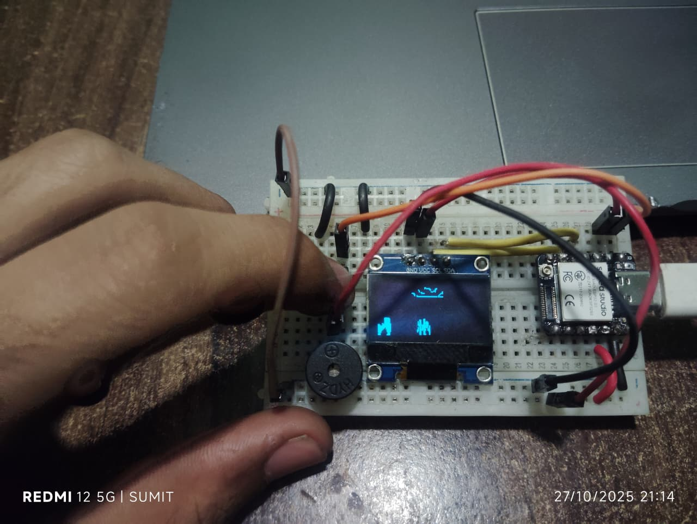
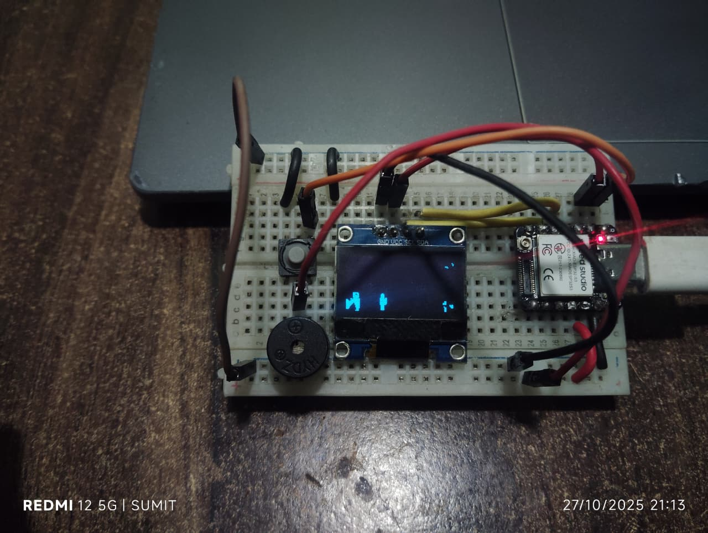
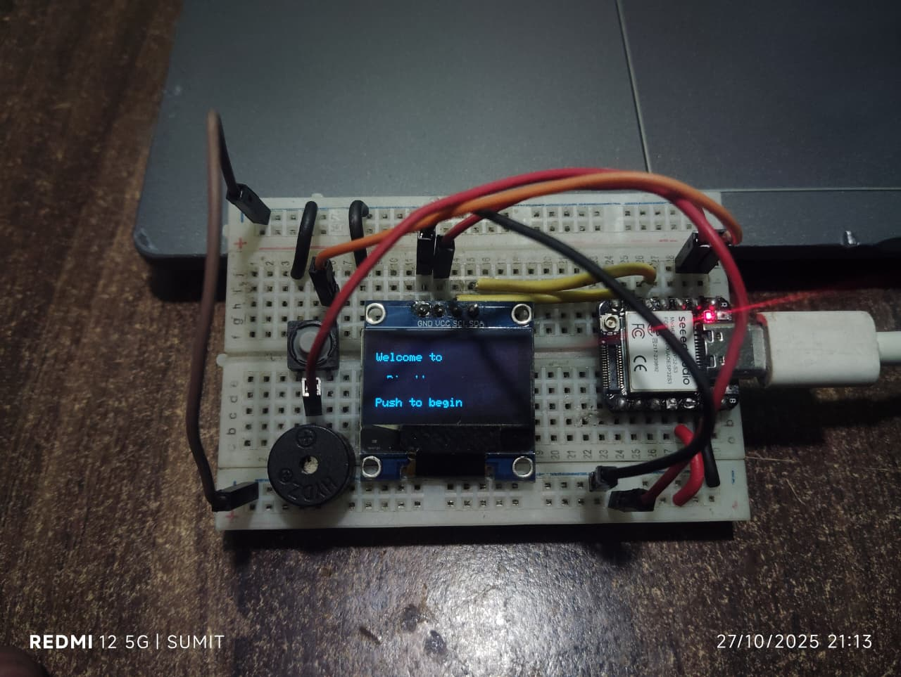

**Week 1 of my #1ProjectPerWeek challenge!**

Kicking off this journey where I’ll be building, modifying, and documenting one project every week — no excuses.
This week’s build: The **classic Dino Game**, but running on a tiny 128×64 OLED display.

I took the nostalgic Chrome Dino and reimagined it for embedded hardware optimized frame rendering, added simple jump physics, and made it run smooth on limited resources.
It’s not just about remaking old games it’s about learning how systems think in tight memory and timing constraints.

This marks the start of my consistency challenge 1 week, 1 project, every week.
If I skip, I double next week 😤

-   -   -   -   -   -   -   -   -   -   -   -

-   -   -   -   -   -   -   -   -   -   -   -

